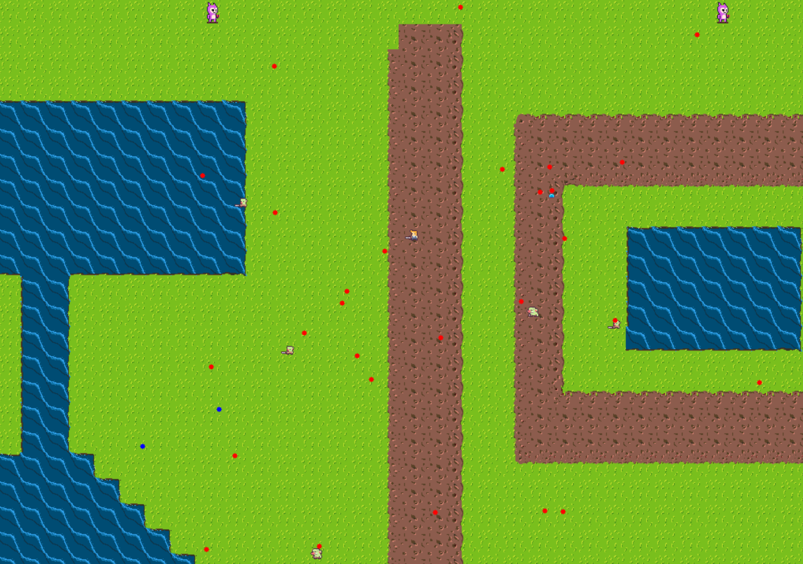

# 🎮 Survivor Game – C++ / GamesEngineeringBase Engine

Survivor Game is a 2D survival-style action game built using **C++**, the **GamesEngineeringBase** framework, and a custom real-time game loop.  
Your goal is to survive waves of enemies, complete levels, and progress through increasingly difficult stages.

---

## 📸 Screenshots

  

  

---

## 🕹️ Features

### 🌍 World Modes
- **Finite World** – Limited map size  
- **Infinite World** – World wraps infinitely  
- **Load Saved Game** – Continue where you left off  
- **Exit** – Quit from the main menu  

### ⚔️ Gameplay Mechanics
- Move the hero across the map  
- Fight or avoid enemies  
- AOE attacks when triggered  
- Level progression (each level lasts 2 minutes)  
- +20% difficulty increase per level  
- Game Over screen if the hero dies  

---

## 💾 Save & Load System

Press **K** during gameplay to save:
- Hero stats  
- Enemy states  
- World mode (finite or infinite)  

## 🧠 Technical Highlights

### 🔄 Real-Time Game Loop
Every frame updates:
- Hero movement  
- Enemy behavior  
- World rendering  
- Camera tracking  
- AOE display  
- FPS timer  

### 🖥️ Menu System (Console)
- Select world mode  
- Load saved game (if available)  
- Exit program  

### ⏱️ Frame Timing with `std::chrono`
Delta time (dt) and FPS are calculated with high-resolution timers.

---

## 🔧 Controls

| Key | Action |
|-----|--------|
| **W / A / S / D** | Move hero |
| **K** | Save game |
| **ESC** | Exit to menu |
| **AOE Auto** | Activated when triggered |

(Modify to match your actual controls if needed.)

---

## ▶️ How to Run

1. Build using **Visual Studio** (recommended).  
2. Ensure all resources in `/Resources` are placed next to the executable.  
3. Run the game — menu will appear in console.  
4. Choose world mode and start playing.

---

## ✔️ Requirements
- C++17 or later  
- Windows OS  
- GamesEngineeringBase framework  
- Visual Studio  

---

## 🌟 Possible Future Enhancements
- Add sound effects  
- New enemy types or boss fights  
- Better UI instead of console  
- XP / leveling system  
- Improved animation blending  

---

## 📜 License
This project uses course-provided frameworks and assets.  
Your additions may be licensed however you choose.

---

## 🙌 Acknowledgements
- GamesEngineeringBase provided by course instructors  
- Sprites used for educational purposes  

